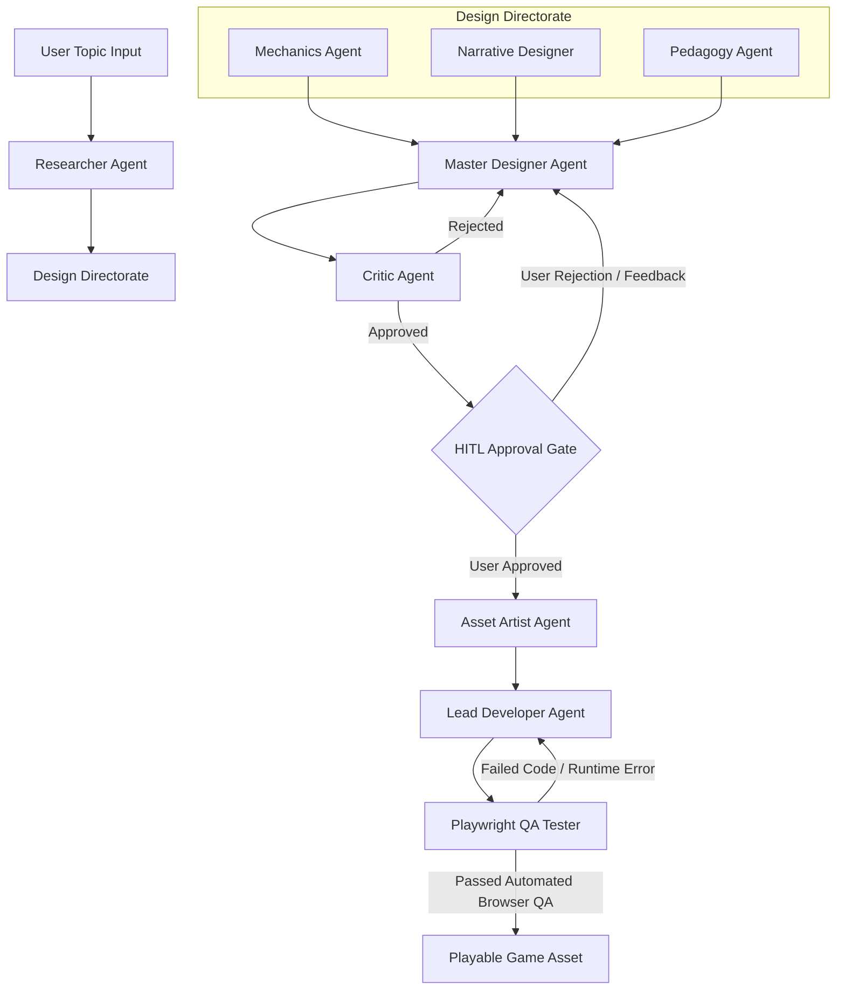

# 🎮 AI Educational Game Generator

[](https://fastapi.tiangolo.com/)
[](https://github.com/langchain-ai/langgraph)
[](https://phaser.io/)
[](https://vitejs.dev/)
[](https://ollama.ai/)
[](https://playwright.dev/)

An autonomous, multi-agent AI system that generates playable, novel HTML5 educational games based on user-provided topics. Powered by local LLMs via **Ollama**, orchestrated with **LangGraph**, verified using **Playwright**, and rendered with **Phaser 3** and custom interactive HTML5 canvas components.

---

## 🌟 Executive Summary

Traditional educational game generators often fall into the trap of producing repetitive, template-bound output (e.g., standard falling-object catchers or basic quiz flashcards). 

This platform eliminates template bias through a **Genre-Aware Multi-Agent Pipeline**. Given any topic (e.g., *"Tic Tac Toe Strategy"*, *"Labyrinth Maze Explorer"*, *"Slingshot Physics"*), the pipeline dynamically maps the educational domain into an appropriate gameplay genre, compiles a Game Design Document (GDD), pauses at a **Human-In-The-Loop (HITL)** approval breakpoint, authors full playable Phaser 3 / HTML5 code, and verifies execution via headless browser QA testing.

---

## 🏗️ Architecture & Multi-Agent Pipeline

The generation pipeline is built using **LangGraph** stateful workflows. Each specialist sub-agent handles a specific layer of game design and software engineering:



### Agent Roles & Responsibilities

| Agent | Module | Description |
| :--- | :--- | :--- |
| **Researcher Agent** | `backend/app/agents/researcher.py` | Performs web searches via `DDGS` / Bing to extract 4–5 key educational facts for the given topic. |
| **Mechanics Agent** | `backend/app/agents/mechanics.py` | Auto-detects target genres based on topic keywords and designs topic-appropriate game mechanics. |
| **Narrative Designer** | `backend/app/agents/narrative.py` | Crafts thematic settings, hero lore, and objective narrative hooks. |
| **Pedagogy Agent** | `backend/app/agents/pedagogy.py` | Converts research facts into dynamic gameplay rewards, true/false rules, and interactive distractors. |
| **Master Designer** | `backend/app/agents/master_designer.py` | Synthesizes all sub-agent concepts into a canonical Game Design Document (GDD). |
| **Critic Agent** | `backend/app/agents/critic.py` | Evaluates GDD against quality constraints, rejecting generic templates and enforcing genre rules. |
| **HITL Gate** | `backend/app/graph/workflow.py` | Pauses LangGraph execution, presenting the GDD to the user for approval or feedback. |
| **Asset Artist** | `backend/app/agents/asset_artist.py` | Generates procedural vector graphics specs, color palettes, and inline sprite instructions. |
| **Lead Developer** | `backend/app/agents/lead_developer.py` | Authors complete, standalone HTML5/Phaser 3 single-file games using genre-specific engine builders. |
| **QA Tester** | `backend/app/qa/runner.py` | Boots headless Chromium via **Playwright** to test canvas rendering, DOM elements, and console errors. |

---

## 🎲 Supported Gameplay Genres

The system features 6 primary genre engines to ensure diverse gameplay:

1. ⭕ **Grid / Board / Turn-Based Games** (e.g. *Tic-Tac-Toe, Matrix Match, Sudoku Grid*)
   - *Controls*: Click 3x3 grid cells to answer concept questions and place marks ($X$ or $O$).
2. 🗺️ **Maze & Dungeon Explorers** (e.g. *Labyrinth Explorer, Dungeon Crawler*)
   - *Controls*: Arrow Keys / WASD hero navigation, collecting gems, dodging traps, reaching exit portal.
3. 🎯 **Physics Slingshot & Launchers** (e.g. *Catapult Trajectory, Angle Shooter*)
   - *Controls*: Drag backward and release launcher to hit knowledge towers.
4. 🏃 **Gravity Runner Platformers** (e.g. *Endless Runner, Flip Runner*)
   - *Controls*: Tap Spacebar to flip gravity between floor and ceiling over spikes.
5. 🏎️ **Vehicle Slalom Dodgers** (e.g. *3-Lane Highway Dodger, Hovercraft Slalom*)
   - *Controls*: Left & Right Arrow keys to switch lanes and hit speed boost concept pads.
6. 🚀 **Space & Turret Defense Shooters** (e.g. *Orbital Defense, Asteroid Shooter*)
   - *Controls*: Left & Right Arrow keys to steer ship, Spacebar to fire photon lasers.

---

## 🛠️ Technology Stack

* **Backend**: Python 3.10+, FastAPI, LangGraph, SQLite, Uvicorn, WebSockets
* **Local Inference / LLM**: Ollama (`gemma4:latest` or `llama3`)
* **Automated QA**: Playwright (Headless Chromium)
* **Frontend**: React 19, Vite 8, Lucide Icons, Canvas Confetti
* **Game Engines**: Phaser 3 (CDN), HTML5 Canvas, Vanilla JS / CSS

---

## 🚀 Installation & Setup Guide

### Prerequisites
* **Python 3.10+**
* **Node.js 18+** & `npm`
* **Ollama** installed and running locally (`ollama serve`)

### 1. Clone the Repository
```bash
git clone https://github.com/YOUR_USERNAME/ai-educational-game-generator.git
cd ai-educational-game-generator
```

### 2. Set Up Python Virtual Environment & Dependencies
```bash
# Create virtual environment
python3 -m venv venv
source venv/bin/activate

# Install backend dependencies
pip install -r backend/requirements.txt

# Install Playwright browser binaries
playwright install chromium
```

### 3. Set Up Frontend Dependencies
```bash
cd frontend
npm install
cd ..
```

---

## 🏃 Running the Application

### Option A: Run Backend & Frontend Concurrently

**Terminal 1 — Backend (FastAPI API on Port 8000)**:
```bash
source venv/bin/activate
PYTHONPATH=backend uvicorn app.main:app --host 0.0.0.0 --port 8000
```

**Terminal 2 — Frontend (React / Vite App on Port 5173)**:
```bash
cd frontend
npm run dev -- --host 0.0.0.0 --port 5173
```

Now open **`http://localhost:5173/`** in your browser!

---

### Option B: Run End-to-End Automated Pipeline Test

To run an automated test across multiple genres with WebSocket progress logs and Playwright QA:

```bash
source venv/bin/activate
PYTHONPATH=backend python3 test_e2e_pipeline.py
```

---

## 📂 Directory Structure

```text
.
├── backend/
│   ├── app/
│   │   ├── agents/
│   │   │   ├── asset_artist.py      # Graphics & sprite specs generator
│   │   │   ├── base.py              # Ollama caller & JSON extraction tools
│   │   │   ├── critic.py            # GDD quality & constraint evaluator
│   │   │   ├── lead_developer.py    # Phaser 3 / HTML5 multi-genre game builders
│   │   │   ├── master_designer.py   # Topic-aware GDD synthesizer
│   │   │   ├── mechanics.py         # Dynamic genre selector agent
│   │   │   ├── narrative.py         # Lore & setting designer agent
│   │   │   ├── pedagogy.py          # Educational rules & distractor agent
│   │   │   ├── QA_tester.py         # QA agent bridge
│   │   │   └── researcher.py        # Compound search agent
│   │   ├── graph/
│   │   │   ├── state.py             # Agent state schema
│   │   │   └── workflow.py          # LangGraph workflow definition
│   │   ├── qa/
│   │   │   └── runner.py            # Playwright browser QA runner
│   │   └── main.py                  # FastAPI server & WebSockets
│   └── requirements.txt
├── frontend/
│   ├── src/                         # React UI dashboard & game preview modal
│   ├── index.html
│   └── package.json
├── output/
│   └── games/                       # Generated playable HTML5 games
├── test_e2e_pipeline.py             # E2E pipeline test script
├── implementation_plan.md
└── README.md
```

---

## 🤝 Contributing

Contributions, issues, and feature requests are welcome! Feel free to check the [Issues page](../../issues).

---

## 📄 License

This project is licensed under the MIT License.
