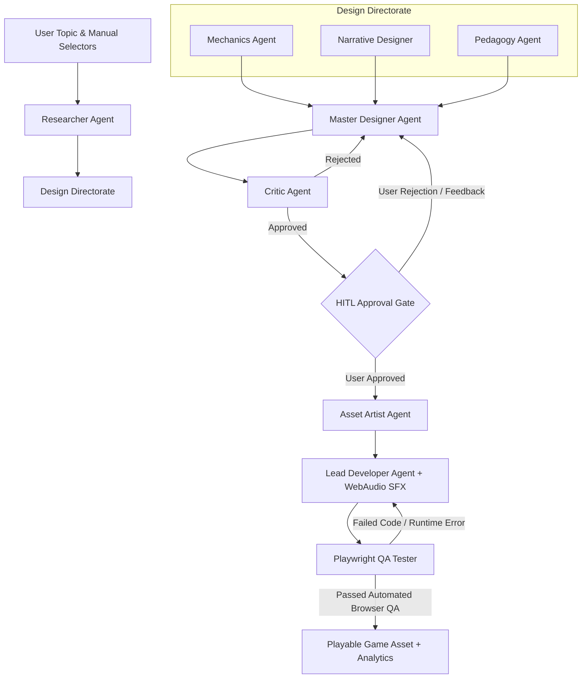

# 🎮 AI Educational Game Generator

[](https://fastapi.tiangolo.com/)
[](https://github.com/langchain-ai/langgraph)
[](https://phaser.io/)
[](https://vitejs.dev/)
[](https://ollama.ai/)
[](https://playwright.dev/)

An autonomous, multi-agent AI system that generates playable, novel HTML5 educational games based on user-provided topics. Powered by local LLMs via **Ollama**, orchestrated with **LangGraph**, verified using **Playwright**, and rendered with **Phaser 3**, **procedural WebAudio API sound synthesis**, and custom interactive HTML5 canvas components.

---

## 🌟 Executive Summary

Traditional educational software generation often suffers from repetitive template bias (e.g. falling flashcards or simple multiple-choice quizzes). 

The **AI Educational Game Generator** solves this using an autonomous **Multi-Agent Pipeline** powered by **LangGraph**. Given any educational topic (such as *"Fractions"*, *"Pythagorean Theorem"*, *"Photosynthesis"*, or *"Cybersecurity"*), the system:
1. Researches core facts using an automated search agent.
2. Brainstorms genre-matched game mechanics and narrative hooks.
3. Synthesizes a rigid **Game Design Document (GDD)**.
4. Pauses at a **Human-In-The-Loop (HITL)** approval breakpoint for user review or feedback.
5. Generates production-ready single-file HTML5/Phaser 3 game code equipped with **WebAudio sound synthesis**.
6. Boots a headless browser via **Playwright** to execute automated QA checks, ensuring zero runtime errors before presenting the finished game to the user.

---

## 🔥 Comprehensive Feature List

* 🕹️ **13 Universal 2D Gameplay Genre Engines**: Dynamically matches educational concepts into 13 distinct arcade, puzzle, RPG, and platformer genres.
* 🔊 **Procedural WebAudio Sound Synthesis Engine**: Synthesizes retro sound effects (laser pulses, collisions, engine revs, power-ups, victory chimes) directly in the browser with zero external MP3/WAV file dependencies.
* 🎛️ **Genre & Grade Level Configuration Controls**: Allows users to manually force specific gameplay genres or configure target grade difficulty (Elementary K-5, Middle School 6-8, High School AP, College/Adult) directly from the React dashboard UI.
* 🛑 **Human-In-The-Loop (HITL) GDD Approval Breakpoint**: Pauses execution post-design to let users inspect, approve, or provide custom feedback on the generated Game Design Document (GDD).
* 🧪 **Headless Browser Automated QA**: Playwright boots Chromium to execute and test game code for JavaScript/canvas runtime errors before serving to the user.
* 📊 **Post-Game Educational Mastery Analytics Report**: Displays an interactive student performance report after gameplay, tracking accuracy rating, concept attempts, and awarding achievement badges (e.g. *Master Strategist*, *Concept Apprentice*).
* 💾 **1-Click Standalone Offline Exporter**: Download self-contained HTML files containing full Phaser engine code, WebAudio synthesizers, and embedded styles for offline LMS deployment.
* ⚡ **Real-Time WebSocket Agent Visualizer**: Displays live step-by-step progress, agent thoughts, and system logs in the React dashboard.

---

## 🏗️ Architecture & Multi-Agent Pipeline

The generation pipeline is built using **LangGraph** stateful workflows. Each specialist sub-agent handles a specific layer of game design and software engineering:



### Agent Roles & Responsibilities

| Agent | Module | Description |
| :--- | :--- | :--- |
| **Researcher Agent** | `backend/app/agents/researcher.py` | Performs web searches via `DDGS` / Bing to extract 4–5 key educational facts for the given topic. |
| **Mechanics Agent** | `backend/app/agents/mechanics.py` | Auto-detects target genres or respects user genre overrides to design custom mechanics. |
| **Narrative Designer** | `backend/app/agents/narrative.py` | Crafts thematic settings, hero lore, and objective narrative hooks. |
| **Pedagogy Agent** | `backend/app/agents/pedagogy.py` | Converts research facts into dynamic gameplay rewards, true/false rules, and interactive distractors. |
| **Master Designer** | `backend/app/agents/master_designer.py` | Synthesizes sub-agent concepts into a canonical Game Design Document (GDD) with locked genre specs. |
| **Critic Agent** | `backend/app/agents/critic.py` | Evaluates GDD against quality constraints, rejecting generic templates and enforcing genre rules. |
| **HITL Gate** | `backend/app/graph/workflow.py` | Pauses LangGraph execution, presenting the GDD to the user for approval or feedback. |
| **Asset Artist** | `backend/app/agents/asset_artist.py` | Generates procedural vector graphics specs, color palettes, and inline sprite instructions. |
| **Lead Developer** | `backend/app/agents/lead_developer.py` | Authors complete, standalone HTML5/Phaser 3 single-file games using genre-specific engine builders & WebAudio SFX. |
| **QA Tester** | `backend/app/qa/runner.py` | Boots headless Chromium via **Playwright** to test canvas rendering, DOM elements, and console errors. |

---

## 🎲 Supported 13 Gameplay Genre Specifications

1. 🧱 **Brick Breaker / Arkanoid Paddle Physics**
   - *Controls*: Horizontal paddle to bounce balls, smash concept bricks, and trigger power-ups.
2. 🏃 **2D Side-Scrolling Jump & Run Platformer**
   - *Controls*: Arrow Keys to run and jump over pits, stomping target enemies to reach the flag.
3. 🔮 **Bubble Shooter / Match-3 Cannon**
   - *Controls*: Aim and fire colored concept spheres at matching clusters to trigger chain reactions.
4. 🏰 **Tower Defense & Base Guardian**
   - *Controls*: Place strategic defensive turrets along a path to destroy incoming wave creeps.
5. 🧙‍♂️ **Top-Down Retro RPG Quest & Battle**
   - *Controls*: Explore an 8-bit overworld map, talk to wizard NPCs, and battle boss encounters.
6. 🎴 **Card Match & Memory Concentration**
   - *Controls*: Flip hidden cards to pair matching educational terms, formulas, and visual diagrams.
7. 🔤 **Word Scramble & Vocabulary Solver**
   - *Controls*: Unscramble missing educational terms and formula keywords letter-by-letter.
8. ⭕ **Grid / Board / Turn-Based Game**
   - *Controls*: Click 3x3 grid cells to answer concept questions and place marks ($X$ or $O$).
9. 🗺️ **Maze & Dungeon Explorer**
   - *Controls*: Arrow Keys / WASD hero navigation, collecting gems, dodging traps, reaching exit portal.
10. 🎯 **Physics Slingshot & Trajectory Launcher**
    - *Controls*: Drag backward and release launcher to hit knowledge towers.
11. 🤸 **Gravity-Flipping Runner Platformer**
    - *Controls*: Tap Spacebar to flip gravity between floor and ceiling over spikes.
12. 🏎️ **High-Speed Slalom / Vehicle Dodger**
    - *Controls*: Left & Right Arrow keys to switch lanes and hit speed boost concept pads.
13. 🚀 **Arcade Space & Defense Shooter**
    - *Controls*: Left & Right Arrow keys to steer ship, Spacebar to fire photon lasers.

---

## 🛠️ Technology Stack

* **Backend Framework**: FastAPI, Python 3.10+, Uvicorn, WebSockets
* **Orchestration & State**: LangGraph, SQLite
* **Local Inference / LLMs**: Ollama (`gemma4:latest` or `llama3`)
* **Automated QA Verification**: Playwright (Headless Chromium)
* **Frontend UI**: React 19, Vite 8, Lucide Icons, Canvas Confetti
* **Game Engines & Audio**: Phaser 3 (CDN), WebAudio API, HTML5 Canvas, Vanilla JS / CSS

---

## 🚀 Installation & Setup Guide

### Prerequisites
* **Python 3.10+**
* **Node.js 18+** & `npm`
* **Ollama** installed and running locally (`ollama serve`)

### 1. Clone the Repository
```bash
git clone https://github.com/Shivam-Brahmkshatriya/AI-Educational-Game-Generator.git
cd AI-Educational-Game-Generator
```

### 2. Set Up Python Virtual Environment & Dependencies
```bash
# Create virtual environment
python3 -m venv venv
source venv/bin/activate

# Install backend dependencies
pip install -r backend/requirements.txt

# Install Playwright browser binaries
playwright install chromium
```

### 3. Set Up Frontend Dependencies
```bash
cd frontend
npm install
cd ..
```

---

## 🏃 Running the Application

### Option A: Run Backend & Frontend Concurrently

**Terminal 1 — Backend (FastAPI API on Port 8000)**:
```bash
source venv/bin/activate
PYTHONPATH=backend uvicorn app.main:app --host 0.0.0.0 --port 8000
```

**Terminal 2 — Frontend (React / Vite App on Port 5173)**:
```bash
cd frontend
npm run dev -- --host 0.0.0.0 --port 5173
```

Open **`http://localhost:5173/`** in your browser!

---

## 📂 Project Directory Structure

```text
.
├── backend/
│   ├── app/
│   │   ├── agents/
│   │   │   ├── asset_artist.py      # Graphics & sprite specs generator
│   │   │   ├── base.py              # Ollama caller & JSON extraction tools
│   │   │   ├── critic.py            # GDD quality & constraint evaluator
│   │   │   ├── lead_developer.py    # Phaser 3 / HTML5 13-genre game builders + WebAudio SFX
│   │   │   ├── master_designer.py   # Topic-aware GDD synthesizer & genre enforcement
│   │   │   ├── mechanics.py         # Dynamic genre selector & override agent
│   │   │   ├── narrative.py         # Lore & setting designer agent
│   │   │   ├── pedagogy.py          # Educational rules & distractor agent
│   │   │   ├── QA_tester.py         # QA agent bridge
│   │   │   └── researcher.py        # Compound search agent
│   │   ├── graph/
│   │   │   ├── state.py             # Agent state schema (includes genre & grade override)
│   │   │   └── workflow.py          # LangGraph workflow definition & HITL breakpoint
│   │   ├── qa/
│   │   │   └── runner.py            # Playwright browser QA runner
│   │   └── main.py                  # FastAPI server & WebSockets
│   └── requirements.txt
├── frontend/
│   ├── src/                         # React UI dashboard, genre selectors & preview modal
│   │   ├── components/              # Pipeline visualizer, GDD approval, game preview & downloader
│   │   └── App.jsx
│   ├── index.html
│   └── package.json
├── output/
│   └── games/                       # Generated playable single-file HTML5 games
└── README.md
```
