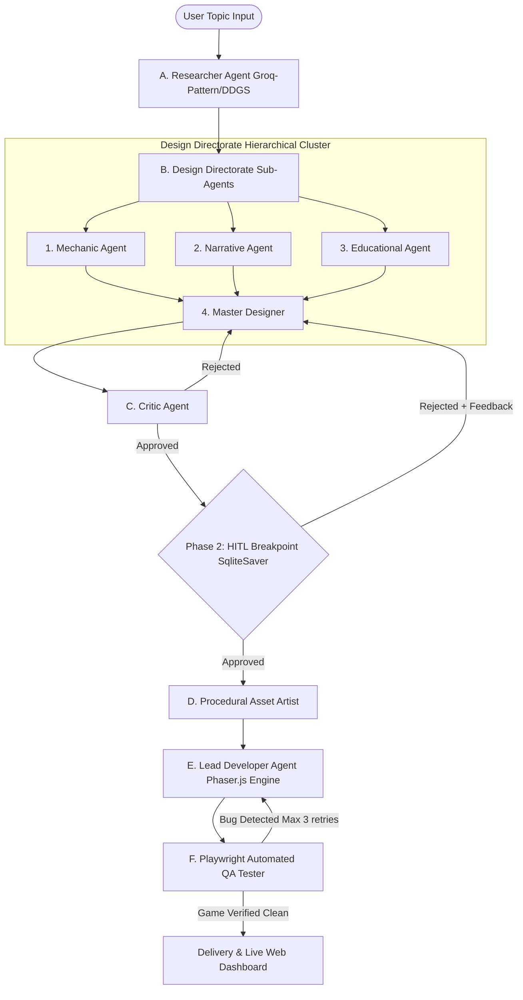

# Architectural Specification & Implementation Plan: Local AI Educational Game Generator

## Executive Summary
This document specifies the architecture and implementation strategy for a **100% Local, Offline-Capable AI Educational Game Generator**. The system uses **Ollama with the local `gemma4:latest` model**, **LangGraph (Python)** multi-agent orchestration, **SQLite** persistence for Human-In-The-Loop (HITL) review breakpoints, **Playwright** automated browser QA testing, and a modern **React + FastAPI** Web Dashboard.

All external cloud APIs (Groq, Google AI Studio, Pollinations.ai) are eliminated. 2D graphics and sprites are dynamically generated using **Procedural Graphics Generators** (Phaser 3 vector graphics, canvas textures, and inline SVG data URIs), ensuring zero runtime asset loading errors or 403 Forbidden issues.

---

## Key System Changes & Design Pillars

### 1. 100% Local Intelligence (`ollama` + `gemma4:latest`)
- **Model Engine**: Local Ollama server (`http://localhost:11434`) using `gemma4:latest` (8B parameters Q4_K_M).
- **Resilience Layer**: Direct `httpx` async client with retry logic, structured JSON repair parsers, and custom prompt templates tailored specifically for Gemma's context window and instruction tuning.

### 2. Zero External Asset Dependencies (Procedural Art Engine)
- **Asset Artist Replacement**: Replaces external image generation (Pollinations.ai) with an inline **Procedural Canvas & SVG Asset Builder**.
- **Self-Contained Phaser.js**: Games produce dynamic geometric shapes, particle effects, custom retro SVG sprites, and procedurally generated textures inside Phaser 3 scenes.

### 3. Multi-Agent Orchestration Architecture (LangGraph + SQLite)


### 4. Interactive Web Dashboard (React + FastAPI + WebSockets)
- **Real-Time Pipeline Visualizer**: Shows live state transitions and agent logs across Phase 1 to Phase 4.
- **HITL Gate UI**: Modal interface allowing users to inspect the GDD, read educational objectives, approve, or submit modification requests.
- **Live Sandbox Preview**: Interactive iframe playing the generated Phaser game instantly upon build completion.
- **Game Collection Gallery**: Browse and play previously generated educational games.

---

## User Review Required

> [!IMPORTANT]
> **Key Architecture Decisions for Approval:**
> 1. **Ollama Execution Mode**: All agents execute concurrently or sequentially using `http://localhost:11434` with model `gemma4:latest`. 
> 2. **Procedural Graphics over Pollinations**: Phaser 3 native graphics (`this.add.graphics()`, procedural textures, and embedded SVG URIs) will be used to ensure games are 100% functional offline without broken image links.
> 3. **HITL Interruption Mechanism**: Built using standard LangGraph `SqliteSaver` checkpointer and `interrupt()`. The FastAPI backend handles user approval/rejection signals and resumes graph execution seamlessly via WebSockets.

---

## Proposed Changes & Codebase Structure

We will initialize the workspace `/home/rog/Desktop/New Trial ollama` with a clean, production-grade project structure:

```
New Trial ollama/
├── backend/
│   ├── app/
│   │   ├── __init__.py
│   │   ├── main.py                     # FastAPI server, WebSocket endpoints, static file hosting
│   │   ├── config.py                   # System configuration & Ollama settings
│   │   ├── agents/                     # Multi-Agent Roster
│   │   │   ├── __init__.py
│   │   │   ├── base.py                 # Ollama Gemma LLM helper, JSON repair parser
│   │   │   ├── researcher.py           # DuckDuckGo compound searcher
│   │   │   ├── mechanics.py            # Gameplay sub-agent
│   │   │   ├── narrative.py            # Story/Theme sub-agent
│   │   │   ├── educational.py          # Learning objectives sub-agent
│   │   │   ├── master_designer.py      # Master GDD Synthesizer
│   │   │   ├── critic.py               # Quality & constraint validator
│   │   │   ├── asset_artist.py         # Procedural art palette & sprite specifier
│   │   │   ├── lead_developer.py       # Phaser 3 HTML5 Game Code Author
│   │   │   └── qa_tester.py            # Playwright browser QA sub-agent
│   │   ├── graph/                      # LangGraph Workflow Definition
│   │   │   ├── __init__.py
│   │   │   ├── state.py                # TypedDict Game State Schema
│   │   │   └── workflow.py             # LangGraph graph builder with SQLite checkpointer
│   │   └── qa/                         # Playwright QA Executor
│   │       ├── __init__.py
│   │       └── runner.py               # Playwright headless runner & log capture
│   └── requirements.txt                # Python dependencies
├── frontend/                           # React + Vite Web UI
│   ├── package.json
│   ├── vite.config.js
│   ├── src/
│   │   ├── App.jsx                     # Master Dashboard
│   │   ├── components/
│   │   │   ├── PipelineVisualizer.jsx  # Real-time Agent Graph & Status
│   │   │   ├── GddApprovalModal.jsx    # HITL Breakpoint Review Component
│   │   │   ├── GamePreview.jsx         # Live iframe Phaser sandbox
│   │   │   ├── CodeViewer.jsx          # Generated index.html inspector
│   │   │   └── GameGallery.jsx         # Saved games showcase
│   │   └── index.css                   # Glassmorphic Dark-Mode UI Theme
└── output/                             # Generated Games directory
    └── games/
```

---

## Verification Plan

### Automated Tests
1. **Ollama Integration Test**: Python script verifying Gemma local LLM response speed and structured JSON output parsing.
2. **LangGraph Pipeline Run**: Test execution of Phase 1 through Phase 4 with simulated user input and HITL state pause/resume.
3. **Playwright QA Verification**: Validate Playwright headless Chromium execution on a generated game file.

### Manual Verification
1. **Interactive UI Review**: Open the React Dashboard on local port, submit educational topics (e.g., "Photosynthesis", "Pythagorean Theorem", "Cybersecurity Basics").
2. **HITL Review Checkpoint**: Inspect the auto-generated GDD in the UI modal, click "Reject with Feedback", verify GDD is rewritten, then click "Approve".
3. **Live Game Playability**: Test generated Phaser.js HTML5 game directly in the embedded iframe sandbox and verify keyboard/mouse controls, procedural graphics, and educational mechanics!
